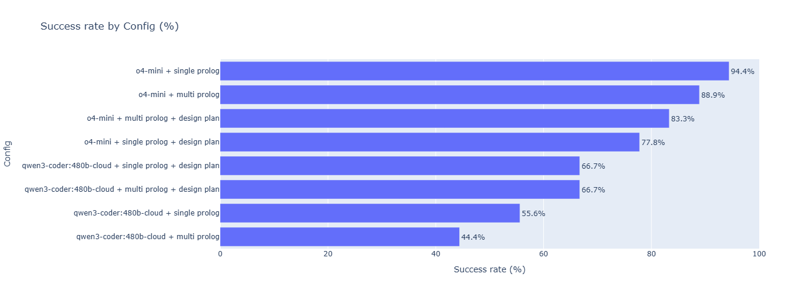
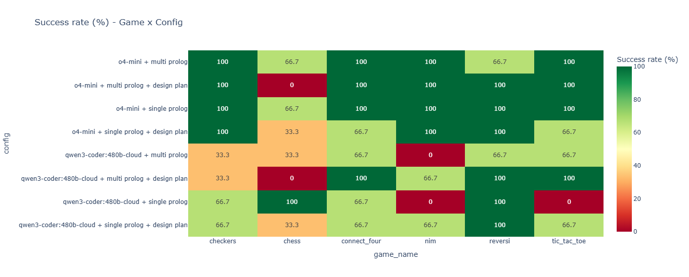
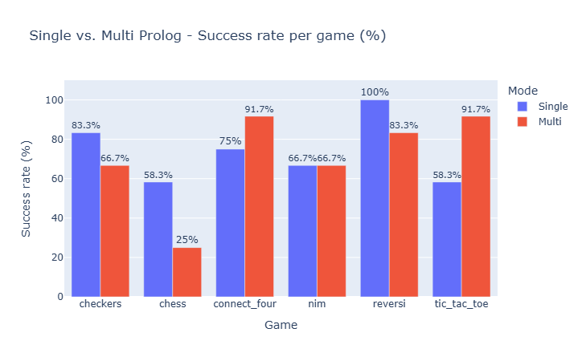
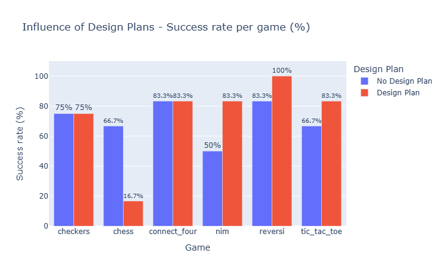
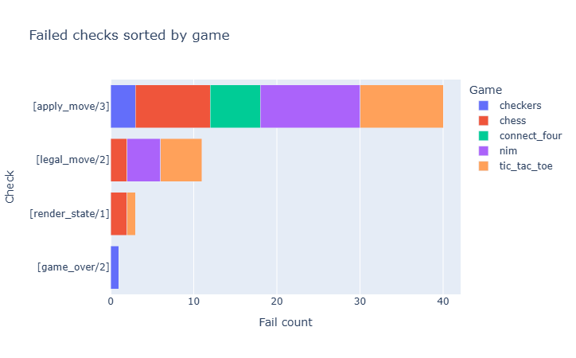

# ProloGame - From Natural Language Rules to Executable Game Logic

Beginners practical \
Summer Term 2026 \
Niclas Leinen (niclas.leinen@stud.uni-heidelberg.de) \
Mohammad Mehdi Khorrami (mohammad.khorrami@stud.uni-heidelberg.de)

## Motivation
ProloGame investigates the ability of Large Language Models (LLMs) to translate natural language rules into playable games, using SWI-Prolog as the underlying game-state engine.

Board games like chess, connect four or checkers can formally be described using a manageable set of state and move rules. Prolog, as a declarative, logic-based programming language, is a perfect match for this kind of ruleset: Game states, legal moves and win conditions can all be expressed as facts and clauses without having to explicitly program the control flow.

The central research question this practical aims to answer is therefore: How accurately and reliably can different LLM-configurations (choice of model, generation strategy) generate executable Prolog code from game rules written in natural language?

To answer this question, we developed a benchmark framework that tests and validates generation of six games across two models and four configurations each. Additionally, we provide a Streamlit application that supports custom game generation from either (A) user-provided game rules or (B) simply the name of a board game, as well as interactive play of the generated games.

## Why Prolog?
Prolog is a logic-based programming language, which forces the LLM to "think" in terms of logical relationships rather than sequential instructions. This makes the model's reasoning ability a deciding factor for code quality, since it must satisfy several interdependent constraints that together determine the game's control flow.

For example, LLMs are trained primarily on imperative and functional languages, where a function like `next_player(p1)` *returns* a value. In Prolog, however, predicates do not return anything; they succeed or fail based on unification. A model that defaults to its imperative intuition might generate `Next = next_player(Player)` instead of the correct `next_player(Player, Next)`, which compiles but silently fails at runtime. Avoiding this class of mistake requires the model to consistently apply Prolog's relational reasoning rather than falling back on patterns learned from other paradigms.

## Pipeline architecture
The generation pipeline consists of the following steps: (Optional: Rule generation &rarr; Rule verification &rarr;) JSON structuring &rarr; (Optional: Design plan &rarr;) Prolog generation &rarr; validation / retry loop.

### 0. Rule generation / verification (Optional)
These steps are only used if the input is not already a rulebook, i.e. when the user provides only the name of a game. In the generation step, the chosen LLM generates natural language rules for the given game (if it recognizes the name); in the verification step, a (possibly different) LLM checks the completeness and correctness of the generated rules. If the rules are found to be invalid, a corrected version is proposed and re-verified up to a configurable maximum number of retries.

### 1. JSON structuring
Games can become complex quickly, and in Prolog, keeping track of what each predicate means and how it connects to the others can be difficult for an LLM to maintain across a long generation. To mitigate this, we structure the core aspects of the game into predefined JSON properties, e.g. `initial_state` or `win_conditions`.

### 1.b Design plan (Optional)
To further improve code-quality, a separate LLM call produces a "design plan" - a more detailed, step-by-step description of how to implement specific parts of the Prolog code, e.g. "Conditions for move legality: 1. ...". This plan is then forwarded to the next step together with the structured JSON output.

### 2. Prolog generation
The Prolog generator takes the structured JSON (and design plan, if available) from the previous stages and converts it into Prolog code. Depending on the configuration, the code is generated either all at once (single step) or incrementally (multiple steps):

- **Single-stage:** The LLM generates the entire Prolog file in one call.
- **Multi-stage:** The LLM generates the code in five stages, one predicate group per stage, using the accumulated code from all previous stages alongside the original structured JSON as context. Each stage is validated before the next one begins (see below), and a stage is retried with targeted error feedback if it fails.

In both modes, the LLM is given a predefined framework it must implement, consisting of six required predicates that together make up the core functionality of every generated game:

- `initial_state`
- `current_player`
- `legal_move`
- `apply_move`
- `game_over`
- `render_state`

### 3. Validation
Once the code has been fully generated, it is run through a series of limited structural and reachability checks. These checks verify that the code loads, that the initial state is fully ground, that at least one legal move exists, that one or several moves can be applied, that the initial state can be rendered, and that `game_over/2` is defined. They do not verify `current_player/2`, the completeness or correctness of all legal moves, rejection of illegal moves, actual win or draw semantics, or complete games through to termination. In single-stage mode, this validation runs once after generation, with a configurable number of retries on failure. In multi-stage mode, each of the five stages is validated incrementally as it is generated; the final stage's validation includes the checks from earlier stages, so no separate validation pass is needed afterward.

## Benchmark Setup
All testing takes place in the [benchmark notebook](notebooks/benchmark.ipynb) benchmark jupyter notebook. For the benchmark, we tested two LLM models with four different configurations each over six games. Each model was given the same rulebook for each game, while the structured JSON was only generated once per game and reused for all remaining runs to increase efficiency. We then ran the generation pipeline three times per game, which produced 2 models $\times$ 4 configs $\times$ 6 games $\times$ 3 runs = 144 results.

### Models
- `qwen3-coder:480b-cloud`
- `o4-mini`

### Configurations
- `single prolog`
- `single prolog + design plan`
- `multi prolog`
- `multi prolog + design plan`

### Games (Links refer to the used rulebooks)
- [Checkers](./testing/rulebooks/checkers.txt) 
- [Chess](./testing/rulebooks/chess.txt)
- [Connect Four](./testing/rulebooks/connect_four.txt)
- [Nim](./testing/rulebooks/nim.txt)
- [Reversi](./testing/rulebooks/reversi.txt)
- [Tic-Tac-Toe](./testing/rulebooks/tic_tac_toe.txt)

## Results
### o4-mini vs. qwen3-coder
Overall, o4-mini performed significantly better and was more reliable than qwen3-coder, with the total success rates being 86.1% and 58.3% respectively. qwen3-coder only managed to create three error-free implementations of a game six out of 24 times, whereas o4-mini hit a success rate of 100% for 17 out of 24 games, generating flawless implementations for checkers and nim regardless of the configuration given. The only game o4-mini struggled with was chess with a 0% success rate for the `multi prolog + design plan` configuration.



Regarding the overall consistency, o4-mini always managed to generate at least 3 games for 3 separate runs without errors, whereas qwen3-coder struggled with at least 2 games for 3 separate runs, producing mixed results (mix of pass / fail), the worst consistency coming from the multi-stage generation, where qwen3-coder only produced mixed-validity results for 5 games and 100% failing results for 1 game. 



### single-stage vs. multi-stage prolog
Using single-stage or multi-stage prolog generation did not seem to make a significant impact on the validity of the output, as single-stage generation has a 72.2% (52 out of 72 runs) success rate and multi-stage follows closely with 70.8% (51 out of 72 runs). Nevertheless, some differences can be seen in the success rate per game regarding the generation mode: more complex games like chess, checkers and reversi were generated more successfully using the single-stage mode rather than the multi-stage mode. On the other hand, multi-stage generation produced more reliable results for simpler games like connect four and tic-tac-toe.



### Influence of the design plan
For most games, the design plan had moderate benefit to no impact at all, with nim profiting the most of the usage (50.0% vs. 83.3%), whereas a bigger negative influence can be seen for chess, with a 50.0% decrease in success rate from the 66.7% that was achieved without a design plan.



### Most common error sources
The most common issue by far was the `apply_move` check, which failed in 72.7% of all failed runs (40 out of 55). Note that because the validator re-derives a legal move before testing `apply_move`, any run that fails the `legal_move` check necessarily also fails the `apply_move` check - the two counts are not independent, and the true `apply_move`-specific failure rate is lower than this number suggests. `legal_move` itself was the primary blocker in 20% (11 out of 55) of failed runs, `render_state` in 5% (3 out of 55) and `game_over` in 2% (1 out of 55).



## Key Learnings
### Prolog-specific failure patterns
LLMs consistently made a small set of characteristic mistakes when writing Prolog code, most of which stem from imperative / functional training biases rather than a lack of domain knowledge:

- Treating predicates as functions with return values (e.g. `Next = next_player(Player)` instead of `next_player(Player, Next)`)
- Pre-unifying variables before passing them into a predicate
- Using strings instead of flat lists to represent the board
- Using uppercase atoms where lowercase was required

These were mitigated through explicit prompt engineering, a few-shot reference implementation (a simple card game, chosen to demonstrate the required predicates without biasing the model toward any specific board representation), and the validator feedback loop described above.

### Multi-stage generation is not a reliable win
Splitting generation into incremental, validated stages did not consistently outperform single-stage generation. It helped on structurally simpler games (e.g. connect four, tic-tac-toe) but hurt on more complex ones (e.g. chess, checkers). Notably, incremental per-predicate validation was what first made a working chess implementation possible at all, even though multi-stage generation is not superior on average. This suggests the benefit of multi-stage generation is game-dependent rather than universal, and may be worth combining selectively based on estimated game complexity rather than applying uniformly.

### The design plan helps selectively
An explicit implementation plan improved success rates for structurally simpler games (nim, reversi, tic-tac-toe) but was actively harmful for chess. One interpretation is that a design plan written in natural language imposes an additional layer of interpretation the generator must correctly follow. For simple games, this extra structure helps, but for chess, where the rules are already quite complex, an imprecise or incomplete plan can introduce constraints that conflict with a correct implementation.

## Outlook
- **Move term readability:** Currently, generated move terms are not guaranteed to be human-readable (e.g. numeric indices rather than coordinates). Enforcing readable move terms directly in the Stage 2 prompt was chosen over a runtime translation layer, since the latter was found to add noticeable latency; a coordinate system could additionally be surfaced during rendering (Stage 5) to make gameplay easier to follow.
- **Broader statistical analysis:** The current results are based on 144 runs (2 models $\times$ 4 configs $\times$ 6 games $\times$ 3 runs each); a larger sample size would strengthen the conclusions drawn here.
- **Additional games or configurations:** Extending the benchmark to games with different structural properties (e.g. hidden information, more than two players) could test whether the observed patterns (multi-stage and design-plan helping simpler games but hurting complex ones) generalize beyond the six games tested here.
- **Adaptive configuration selection:** Since multi-stage generation and the design plan each help some games and hurt others, a natural next step would be to predict (from the structured JSON alone) which configuration is likely to work best for a given game, rather than fixing one configuration across all games.
- **Chain-of-thought traceability:** Currently, it is not possible to determine which specific parts of the structured JSON or design plan the model relied on when generating a given piece of Prolog code. Prompting the generator to explicitly justify each predicate with a reference to the corresponding JSON field or design plan step (or analyzing intermediate reasoning traces, if the model exposes them) could help explain *why* certain configurations succeed or fail for a given game, rather than only observing *that* they do.
- **Improved validation and targeted error fixing:** The current validator only checks reachability and structural correctness from the initial state (or, in later stages, after a small number of chained moves). A more targeted validation approach - placing the game into a specific, hand-picked state (e.g. a near-endgame position) and verifying the correctness of the next 2-3 legal moves and their outcomes - could catch a broader class of logical errors that are not exercised by play starting from the initial state alone.

## Conclusion
This practical explored how well different LLM configurations can translate natural language board game rules into executable, playable SWI-Prolog code. Across 144 benchmark runs spanning two models, four configurations and six games, o4-mini substantially outperformed qwen3-coder in both success rate and consistency, while chess proved to be the hardest game across nearly every configuration tested. Neither multi-stage generation nor the design plan step produced a universal improvement; both helped on structurally simpler games while hurting on more complex ones, suggesting that the ideal generation strategy depends on the game being implemented rather than being fixed in advance.

Beyond the quantitative results, the practical surfaced a recurring set of Prolog-specific failure patterns rooted in the mismatch between LLMs' imperative / functional training bias and Prolog's relational, unification-based semantics. Addressing these through prompt engineering, few-shot examples and a validator feedback loop was necessary to obtain reliable results at all, particularly for more complex games like chess.

While the current benchmark provides a solid basis for comparing LLM configurations on this task, several aspects - a larger sample size and validation that probes beyond the initial game state - would further strengthen the conclusions drawn here. The Streamlit application built alongside the benchmark demonstrates that the approach is not purely academic: The generated Prolog code is directly playable, closing the loop from natural language description to a working game.

## Usage
### Tools / Requirements
- **Python 3.x**
- **[SWI-Prolog](https://swi-prolog.org/download/stable)**: Must be installed separately and available on your system `PATH` (used via `subprocess` for game execution and validation).
- **[Ollama](https://ollama.com)**: Required only if you want to use local models (or ollama cloud models, e.g. `qwen3-coder:480b-cloud`) instead of / alongside the OpenAI API
- An **OpenAI API key**: Required only if you want to use models from OpenAI

The default application configuration uses both services: Ollama with `gemma4:31b-cloud` for rule generation and verification, and OpenAI with `o4-mini` for JSON structuring and Prolog generation. Therefore, the default setup requires a working Ollama installation with access to `gemma4:31b-cloud` and a valid OpenAI API key. The provider and model for rule and Prolog generation can be changed in the app's **Settings** menu. Contributors can add models to the provider-specific `MODEL_CATALOG` in `config.py`.

### High-level dependencies
- `streamlit`: Web frontend for game generation and gameplay
- `ollama`: Python client for local model access
- `openai`: Python client for OpenAI API access
- `plotly`: Result visualization in the benchmark notebook
- `jupyter`: For running the benchmark notebooks

(See `requirements.txt` for the full dependency list)

### Setup
1. Clone the repository
git clone <repo-url> 
cd <repo-name>


2. Install SWI-Prolog (see link above) and confirm it is on your `PATH`:
```bash
swipl --version
```

3. Install Python dependencies:
```bash
pip install -r requirements.txt
```

4. Set up model access:
- For OpenAI models: Create a `.env`-file with the Key-Value pair:
```bash
OPENAI_API_KEY="YourKeyHere"
```

- For the default Ollama configuration: install Ollama, then make sure the configured model is available, e.g.:
```bash
ollama pull gemma4:31b-cloud
```

### Running the Streamlit app
```bash
streamlit run app.py
```

Enter a game name or paste custom game rules to generate a playable implementation, or upload an existing `.pl` file to play directly.

### Running the benchmark
Open `notebooks/benchmark.ipynb` and run all cells. The benchmark uses skip / resume logic based on meta files in `./testing/results/meta/{game}/`, so interrupted runs can be resumed without repeating completed configurations.

## License & Contact
This project is licensed under the MIT License - see [LICENSE](LICENSE) for details. \
Feel free to reach out with any questions: \
niclas.leinen@stud.uni-heidelberg.de \
mohammad.khorrami@stud.uni-heidelberg.de
